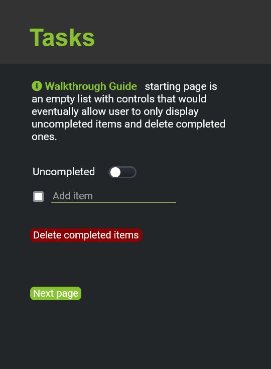

#Decisions
Here we describe different design elements that we decided on including color scheme,
icons and how these attributes fit into the design

###Color Scheme
+ \#25274D for background color
+ White for text so legibility will be easy against the black background
+ \#86C232 for header so it stands out
+ \#333 for header background color to create an aesthetically pleasing header bar

###Icons
+ Button for deleting; red so it signals something drastic is happening and data will
be eminently lost
+ Toggle for show or hide items moreso indicates modality and indicates to the user
that the action can be done and undone
+ Pencil for editing. Disappears in editing more.
+ Checkbox for list items so they can be marked and unmarked depending on status of completion

#Alternatives
We briefly considered using different color schemes that were
brighter and more fun, but we figured it would ultimately be too
distracting. 

#Challenges
A lot of difficulties with styling and making certain elements work. For
instance the toggle button was a lot more code than anticipated. We
also considered making the checkmarks more in tune with the color scheme
but that proved to also be more code than anticipated. 

We decided convention could be kept in this instance, preserving the
checkmark in the checkbox against the blue background. It is not especially distracting in
our design.

We also didn't realize how iframes could be used for the walk through so this is how the 
page initially looked before properly formatting them into an iframe

#Accomplishments
The final output of our pages appears pretty accessible. Proud of the toggle
since it took so much work. And it displays pretty nicely on different screens
